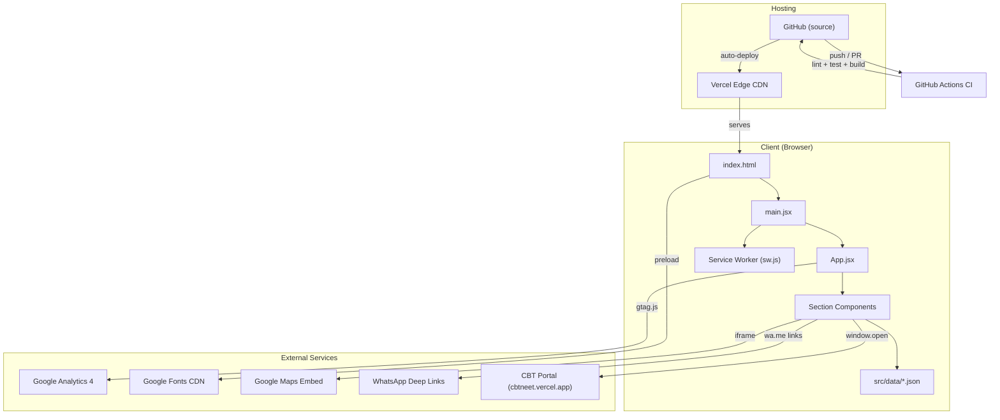
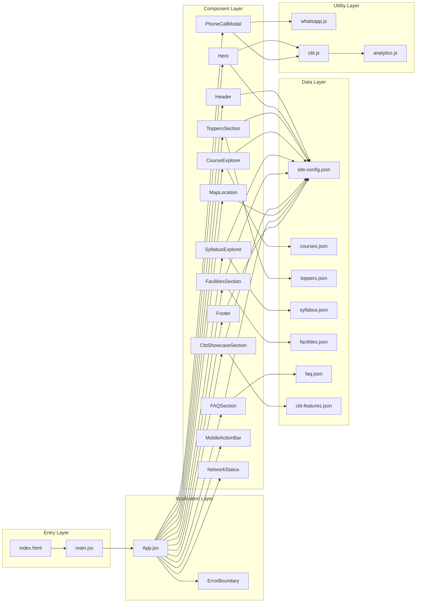
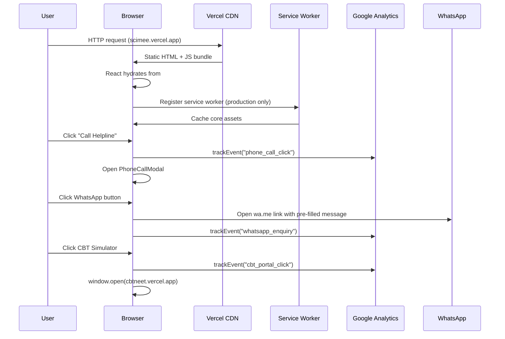
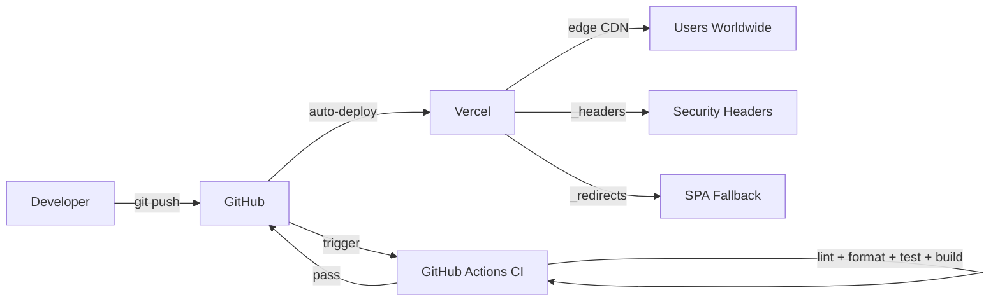

# Architecture

## System Overview

SCIMEE is a fully static, client-side-only single-page application (SPA). It has no backend, no database, no server-side logic, and no authentication. The React app is built at deploy time by Vite into a bundle of static HTML, CSS, and JS files served via Vercel's edge CDN.

## System Diagram

## Tech Stack

| Layer | Technology | Version |
|---|---|---|
| UI Framework | React | 19.2.8 |
| Build Tool | Vite | 6.2.0 |
| Language | JavaScript (ES Modules, JSX) | ES2021+ |
| Styling | Vanilla CSS (custom properties) | — |
| Icons | lucide-react | 1.33.0 |
| Animations | framer-motion | 12.43.0 |
| Class Utilities | clsx | 2.1.1 |
| Testing | Vitest + React Testing Library | 3.0.7 / 16.2.0 |
| Test Environment | happy-dom | 20.11.6 |
| Linting | ESLint (flat config) | 9.20.0 |
| Formatting | Prettier | 3.5.0 |
| Hosting | Vercel | — |
| CI/CD | GitHub Actions | — |
| Analytics | Google Analytics 4 (gtag.js) | — |

## Repository Structure

See `AGENTS.md` → Repository Structure for the full tree.

## Application Layers

### Layer Descriptions

1. **Entry Layer**: `index.html` is the static HTML shell containing all SEO meta tags, JSON-LD structured data, Google Analytics script, font preloads, and the `#root` mount point. `main.jsx` bootstraps the React app and registers the service worker in production.

2. **Application Layer**: `App.jsx` is the root component. It manages the only shared state — the phone call modal open/close state and its trigger context. The `ErrorBoundary` class component wraps the entire app.

3. **Component Layer**: Each section of the page is a standalone component. Components are self-contained — they import their own data, render their UI, and expose a single `onOpenCallModal` callback prop for CTA actions. Sub-components live in named subdirectories (e.g., `header/`, `modal/`).

4. **Data Layer**: All content is in static JSON files under `src/data/`. Components import JSON directly via ES module imports (Vite handles JSON imports). There is no API fetching — data is bundled at build time.

5. **Utility Layer**: Shared logic for analytics event tracking, WhatsApp URL generation, and CBT portal URL resolution.

## Database Architecture

**None.** All data is static JSON bundled at build time. No database, no ORM, no migrations.

## API Architecture

**None.** No REST API, no GraphQL, no backend endpoints. External service integrations:

| Service | Integration Method |
|---|---|
| Google Analytics 4 | `gtag.js` script tag in `index.html` + `trackEvent()` utility |
| Google Maps | Iframe embed URL stored in `site-config.json` |
| WhatsApp | Deep link URLs generated dynamically in `utils/whatsapp.js` |
| CBT Portal | `window.open()` to external URL, configurable via `VITE_CBT_PORTAL_URL` |

## External Services

| Service | Purpose | Configuration |
|---|---|---|
| Vercel | Hosting & CDN | Auto-deploys from GitHub |
| Google Analytics 4 | User behavior tracking | ID: `G-DP9LT3BX5P` in `index.html` |
| Google Search Console | SEO monitoring | Verification: `HP0leUBPcfgag-pSg6t1xmbOM-EJynQ3PItWzzheD08` |
| Google Fonts | Typography (Plus Jakarta Sans, Inter, Noto Nastaliq Urdu, Amiri) | Preloaded in `index.html` |
| Google Maps | Location embed | Iframe URL in `site-config.json` |
| WhatsApp Business | Enquiry channel | Deep links via `wa.me/919175013140` |
| CBT Portal | Online test simulator | `https://cbtneet.vercel.app` (separate deployment) |

## Data Flow

## Architectural Patterns

1. **Static Site Generation (de facto)**: Although Vite doesn't call it SSG, the effect is the same — all HTML, CSS, JS is pre-built and served as static files. No runtime rendering.

2. **Data-Driven Components**: Components are pure presentation — they read from imported JSON and render. Content changes require only JSON edits, not component code changes.

3. **Composition over Configuration**: Complex components (Header, Modal) decompose into sub-components in named directories rather than using configuration objects.

4. **Defensive Programming**: Extensive `?.` and `??` usage ensures no runtime crashes from missing data properties. This is a deliberate architectural choice, not accidental.

5. **Graceful Degradation**: Network failures show a user-friendly banner (NetworkStatus), rendering errors show a recovery UI (ErrorBoundary), and analytics failures are silently caught.

## System Boundaries

| Boundary | Inside | Outside |
|---|---|---|
| SCIMEE Website | React SPA, static JSON, CSS, PWA | CBT Portal (separate repo/deployment) |
| Client-side | All rendering, navigation, state | Google Analytics data processing |
| Build-time | JSON data bundling, Vite compilation | Runtime data fetching |
| Content management | JSON file edits in `src/data/` | No CMS, no admin panel |

## Scalability & Performance Architecture

- **Static Shell Pre-rendering**: The critical above-the-fold HTML structure of the Floating Island Header and Hero display title is pre-rendered directly inside `
` within `index.html`. This enables instantaneous First Contentful Paint (< 300ms) and collapses Largest Contentful Paint to < 0.8s on mobile slow-4G devices before the React bundle even finishes downloading.
- **Direct WOFF2 Font Preloading**: Primary Latin `Plus Jakarta Sans` WOFF2 font file is preloaded via `<link rel="preload" as="font" type="font/woff2" crossorigin>` and defined via inlined `@font-face` with `font-display: swap`, completely eliminating font swap latency (1,090 ms saved).
- **Third-Party Script Deferral**: Google Analytics 4 (`gtag.js`) is deferred to the end of `<body>`, freeing the main thread from 168ms of long-task contention during the initial paint cycle.
- **Dynamic Code-Splitting**: Below-the-fold sections (`SyllabusExplorer`, `FacilitiesSection`, `CbtShowcaseSection`, `MapLocation`, `FAQSection`, `Footer`) are lazy-loaded via `React.lazy()` and `<Suspense>`, reducing initial JS by 57.1% and isolating the 45 KB `syllabus.json` file.
- **Inlined Production CSS**: A custom Vite build plugin (`inlineCss` in `vite.config.js`) inlines compiled CSS (~11.4 KB raw, 3.4 KB gz) directly into `<style>` in `dist/index.html`, eliminating 100% of render-blocking stylesheets.
- **Forced Reflow Prevention**: Scroll listeners in `useHeaderNavigation.js` are throttled via `requestAnimationFrame`, batching geometry calculations to vsync ticks.
- **Zero Cumulative Layout Shift**: `.hero-badges-row` allocates explicit responsive min-heights (44px on desktop, 92px on mobile) to eliminate layout shift caused by badge wrapping.
- **Bundle Splitting**: Manual vendor chunks (`vendor-react`, `vendor-icons`, `vendor`) in `vite.config.js` ensure long-term caching of vendor code.
- **Image Assets**: SVG logo (1.6KB), preloaded with `fetchpriority="high"` for zero CLS.
- **PWA Caching**: Network-first strategy with cache fallback ensures offline resilience.
- **Edge CDN Optimization (`vercel.json`)**: Configured Vercel edge caching (`max-age=31536000, immutable`) and hardened HTTP security headers.

## Security Architecture

- No authentication, no user sessions, no cookies
- All user input is zero — no forms, no uploads, no user-generated content
- Content Security Policy via `_headers` file (Permissions-Policy, HSTS, X-Frame-Options)
- External links use `noopener,noreferrer`
- Environment variables (`VITE_*`) are client-visible — never store secrets

## Deployment Architecture

- **CI Pipeline**: Every push and PR triggers `ci.yml` → ESLint → Prettier → Vitest → Vite Build
- **Deployment**: Vercel auto-deploys from GitHub on push to any branch (preview) or main (production)
- **Cache strategy**: Hashed assets get `max-age=31536000, immutable`; HTML gets `max-age=0, must-revalidate`

## Architecture Decisions

See `DECISIONS.md` for the full decision log.

## Constraints

- Must remain a static site — no server-side logic
- All content in JSON files — no CMS integration
- Single-page architecture — no multi-page routing
- Light theme only — no dark mode
- Vercel hosting (may change) — `_headers` and `_redirects` are Vercel/Netlify compatible
- CBT portal is a separate deployment — not embedded, only linked
